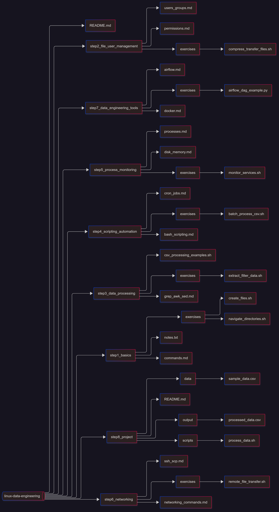

# Linux for Data Engineering - Learning Roadmap

This repository provides a **step-by-step roadmap to learn Linux for Data Engineering**. The goal is to acquire practical skills to manage, process, and automate data workflows on Linux servers, which are widely used in production data engineering environments.

---

## 📂 Project Folder Structure



---

#### 📅 Step-by-Step Learning Roadmap

| Step | Topics                          | Skills & Practical Exercises                                 |
| ---- | ------------------------------- | ------------------------------------------------------------ |
| 1    | **Linux Basics**                | Understand the Linux filesystem, navigate directories, create/remove files, copy/move files, and use basic commands (`ls`, `cd`, `pwd`, `mkdir`, `touch`). Hands-on exercises: create folders and files, practice navigation. |
| 2    | **File Management & Users**     | Learn file permissions, ownership, groups, user creation, and sudo privileges. Hands-on exercises: manage users and groups, set file/folder permissions, compress and transfer files using `tar`, `gzip`, `scp`, and `rsync`. |
| 3    | **Data Processing**             | Learn to process text and structured data using `grep`, `awk`, `sed`, `cut`, and `sort`. Hands-on exercises: extract and filter data from CSV or log files, perform column-based operations. |
| 4    | **Scripting & Automation**      | Write reusable Bash scripts and automate repetitive tasks. Learn `cron` jobs to schedule scripts. Hands-on exercises: create scripts to process multiple files automatically and schedule them via cron. |
| 5    | **Process & System Monitoring** | Learn to monitor system processes, memory, and disk usage (`ps`, `top`, `htop`, `df`, `du`, `free`). Hands-on exercises: monitor services, manage background processes, and log system resource usage. |
| 6    | **Networking & Remote Access**  | Access remote servers via `ssh`, transfer files using `scp` or `rsync`. Learn basic networking commands (`ping`, `traceroute`, `curl`, `wget`). Hands-on exercises: transfer files between local and remote servers, execute commands remotely. |
| 7    | **Data Engineering Tools**      | Install and run Docker containers, manage images and volumes. Install and configure Apache Airflow, create DAGs for data pipelines. Hands-on exercises: build a Docker container for a data workflow, run an example Airflow DAG. |
| 8    | **Final Project**               | Apply all skills to build a **complete data processing pipeline**. Steps include: collecting data, processing data with Bash scripts, storing processed files, and scheduling automated tasks. Hands-on exercises: final project scripts in `step8_project/scripts`, input data in `data/`, and output files in `output/`. |

---

#### 💡 Key Tips

- Practice **hands-on exercises** for each step to reinforce learning.
- Keep all scripts and datasets organized inside **exercises** and **step8_project** folders.
- Use **VMs, WSL, or Docker** to simulate real Linux environments.
- Document commands, scripts, and lessons learned in **notes.txt** files.
- The final project should combine **data collection, processing, storage, and scheduling**.

---

### 🔗 Recommended Resources

- [Linux Command Line Basics](https://linuxcommand.org/) – Beginner-friendly tutorials.
- [Bash Scripting Tutorial](https://ryanstutorials.net/bash-scripting-tutorial/) – Step-by-step scripting guide.
- [Docker Documentation](https://docs.docker.com/) – Learn containerization for data workflows.
- [Apache Airflow Documentation](https://airflow.apache.org/docs/) – Official Airflow guide for building DAGs.
- [Linux System Monitoring](https://www.tecmint.com/linux-monitoring-commands/) – Monitor processes, disk, and memory.

This version:

- Provides **detailed descriptions** for each step.
- Explains **what skills will be gained**.
- Suggests **practical exercises** clearly.
- Makes it **GitHub-ready** and easy for learners to follow.

```
linux-data-engineering/
 │
 ├── step1_basics/
 │   ├── commands.md                # Core Linux commands (ls, cd, pwd, cp, mv, rm, mkdir, etc.)
 │   ├── exercises/
 │   │   ├── create_files.sh        # Practice creating, renaming, and deleting files/folders
 │   │   └── navigate_directories.sh
 │   └── notes.txt                  # Key notes, tips, and shortcuts
 │
 ├── step2_file_user_management/
 │   ├── permissions.md             # File and folder permissions, chmod, chown, ACLs
 │   ├── users_groups.md            # Users, groups, sudo, and user management
 │   └── exercises/
 │       └── compress_transfer_files.sh  # Practice tar, gzip, scp, rsync
 │
 ├── step3_data_processing/
 │   ├── grep_awk_sed.md            # Text processing tools for logs and CSV files
 │   ├── csv_processing_examples.sh
 │   └── exercises/
 │       └── extract_filter_data.sh
 │
 ├── step4_scripting_automation/
 │   ├── bash_scripting.md          # Writing reusable Bash scripts
 │   ├── cron_jobs.md               # Scheduling scripts and automation
 │   └── exercises/
 │       └── batch_process_csv.sh
 │
 ├── step5_process_monitoring/
 │   ├── processes.md               # ps, top, htop, kill, jobs, background processes
 │   ├── disk_memory.md             # df, du, free, iostat, monitoring disk/memory usage
 │   └── exercises/
 │       └── monitor_services.sh
 │
 ├── step6_networking/
 │   ├── ssh_scp.md                 # Remote access and file transfer
 │   ├── networking_commands.md     # netstat, ping, traceroute, curl, wget
 │   └── exercises/
 │       └── remote_file_transfer.sh
 │
 ├── step7_data_engineering_tools/
 │   ├── docker.md                  # Introduction to Docker for containerized environments
 │   ├── airflow.md                 # Installing and running Airflow, DAG examples
 │   └── exercises/
 │       └── airflow_dag_example.py
 │
 ├── step8_project/
 │   ├── README.md                  # Project description and instructions
 │   ├── data/
 │   │   └── sample_data.csv
 │   ├── scripts/
 │   │   └── process_data.sh        # Final project data processing scripts
 │   └── output/
 │       └── processed_data.csv     # Output of final project
 │
 └── README.md
```
